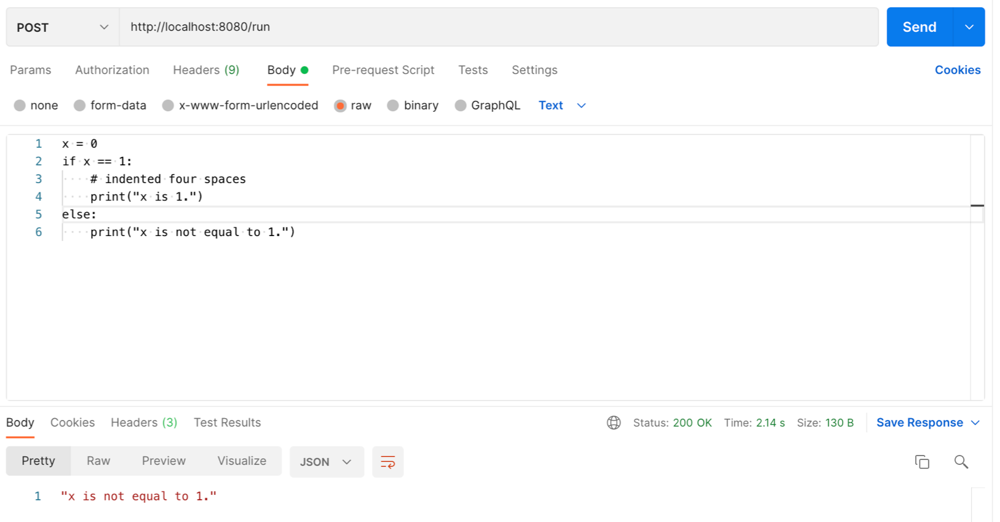
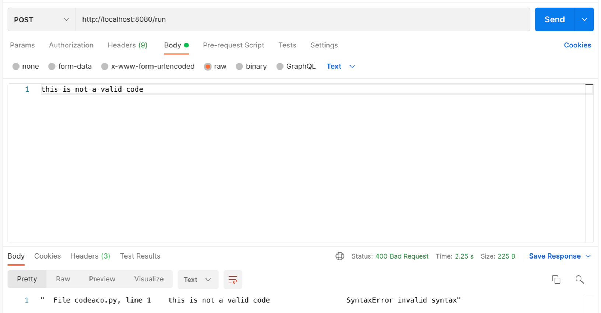

Remote Code Execution 
--------------

Skeleton that runs code inside a docker container and returns response from container logs. This is triggered via HTTP request.
You can extend it to be more dynamic, this is core functionality only.

Examples

1.Valid code:

1.Invalid code:
